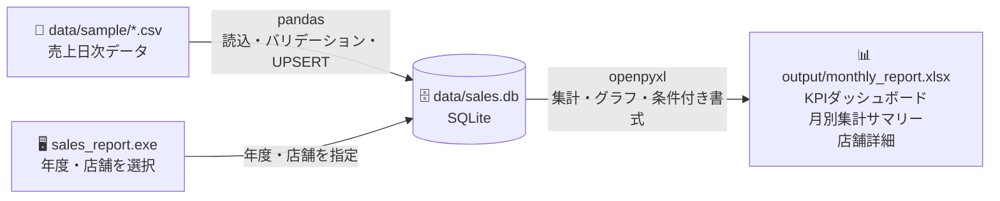

# Excel/CSV 月別売上集計レポート自動生成

複数店舗の日別売上CSVを自動集計し、年度・店舗を切り替えながら月別Excelレポートを確認できるツールです。

> 📌 このツールはポートフォリオ作品です。類似ツールのご依頼は[ランサーズのプロフィール](https://www.lancers.jp/profile/hongu_works?ref=header_menu)からお願いします。

## デモ

### ツール画面
年度・店舗の切り替えとExcel出力をワンクリックで操作できる画面


### KPIダッシュボード
年間総売上・最高/最低/平均月売上・売上No.1店舗・平均客単価・前月比の6つの指標を大きく表示し、月別全店の売上推移と前月比を増減で色分けした一覧表を掲載


### 月別集計サマリー
全店舗の月別売上・客数を一覧表で示し、全店合計の推移と店舗別の比較を2つの棒グラフで可視化


### 店舗詳細
選択中の店舗の月別売上・客数・客単価・前月比・累計売上の一覧表と、売上推移の折れ線グラフ


## 対象クライアント

- 複数店舗を持つ小売業・飲食業の経営者・店長
- 毎月Excelで手集計している担当者
- POSや会計ソフトからCSVエクスポートできる環境

## 使い方

**用意するもの（2つだけ）**

> ```
> 売上レポートツール/
> ├── sales_report.exe      ← ダウンロードしたexe
> └── data/
>     └── sample/
>         └── sales_2024.csv  ← 売上CSVをここに置く(サンプルあり)
> ```

**初回起動後に自動生成されるもの**

> ```
> 売上レポートツール/
> ├── data/
> │   └── sales.db          ← CSVの内容が取り込まれるDB
> └── output/
>     └── monthly_report.xlsx  ← 集計済みExcel
> ```

1. `sales_report.exe` をダブルクリックで起動（初回は自動でCSVを取り込みます）
2. 年度ドロップダウンを選択
   KPIダッシュボード・月別集計サマリーを更新、店舗リストも切り替わる
3. 店舗ドロップダウンで任意の店舗を選択
4. Excelを開くボタンを選択
5. 新しいCSVを追加した場合はDB更新ボタンを選択
   CSVを再取り込みします（CSVにある行は上書き、CSVにない行はDBに保持）

> **補足:** CSVの内容はツール内（`sales.db`）に保存されるので、取り込み済みのCSVファイルは削除しても動作に影響しません。

## 入力CSVのフォーマット

```
日付,店舗名,売上金額,客数
2024-01-01,渋谷店,142000,75
2024-01-01,新宿店,198000,105
...
```

| 列名 | 型 | 説明 |
|------|-----|------|
| 日付 | YYYY-MM-DD | 売上日 |
| 店舗名 | 文字列 | 店舗識別名 |
| 売上金額 | 整数 | 当日売上（円） |
| 客数 | 整数 | 来店客数 |

複数店舗のCSVを同じフォルダに入れるだけで自動的に読み込みます。1ファイルに全店舗まとめてもOKです。

**注意:** 列名は上記の通り正確に入力してください。列名が異なる場合はエラーになります。

---

## 開発者向け情報

<details>
<summary>技術スタック / ディレクトリ構成 / アーキテクチャ / 開発環境</summary>

### 技術スタック

- **Python 3.10+**
- **pandas** — CSV読み込み・バリデーション・ピボット集計
- **openpyxl** — Excelファイル生成・スタイリング・グラフ作成
- **sqlite3** — 売上データの永続化（標準ライブラリ）
- **customtkinter** — モダンなツール画面（丸みボタン・カラーテーマ対応）
- **PyInstaller** — 単一exe配布

### ディレクトリ構成

```
01_excel_csv_automation/
├── README.md
├── requirements.txt           # 依存ライブラリ
├── sales_report.spec          # PyInstallerビルド設定
├── app/                       # アプリ本体（exeはここから生成）
│   ├── gui_launcher.pyw       # GUIエントリポイント
│   └── generate_report.py     # CSV→DB→Excel生成のコアロジック
├── scripts/
│   └── generate_sample_data.py  # サンプルCSV生成用（開発時のみ）
├── data/
│   ├── sample/                # サンプル売上CSV
│   └── sales.db               # CSV取り込み済みDB（gitignore）
├── docs/                      # スクリーンショット
├── output/                    # 生成Excel出力先（gitignore）
└── dist/                      # exe出力先（gitignore）
```

### アーキテクチャ



### 開発環境での実行

Pythonで直接起動する場合は以下のライブラリが必要です。（`sales_report.exe` で起動する場合は不要）

```bash
pip install -r requirements.txt
python app/gui_launcher.pyw
```

### exeのビルド

```bash
pyinstaller sales_report.spec
# → dist/sales_report.exe が生成されます
```

### サンプルデータについて

`data/sample/` に含まれるCSVは以下のスクリプトで生成しました。

```bash
python scripts/generate_sample_data.py
```

</details>
