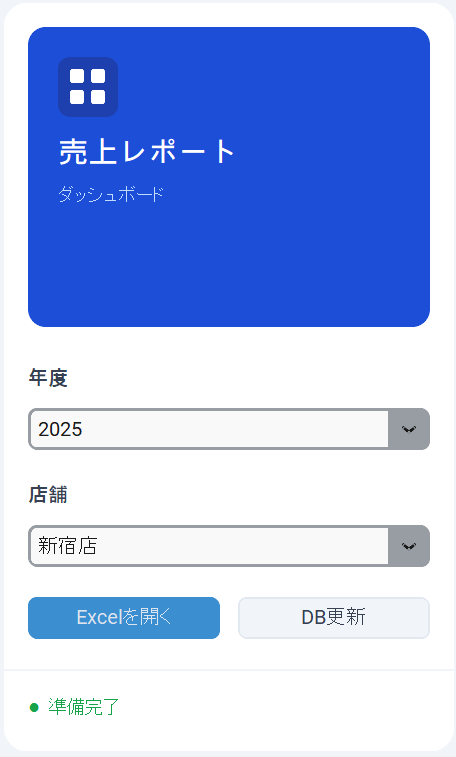
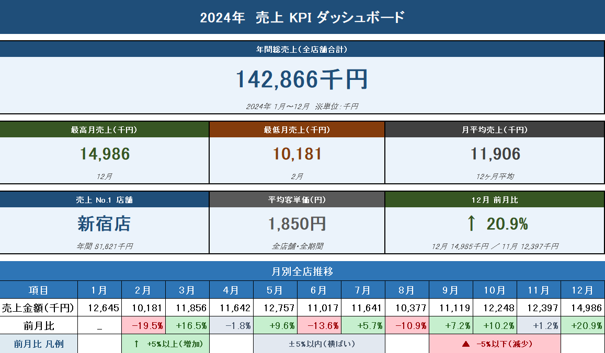
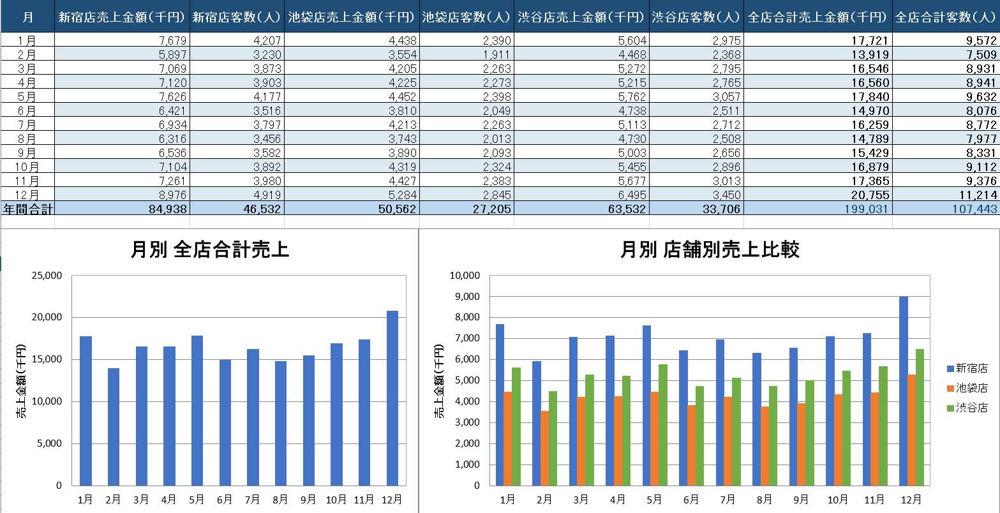
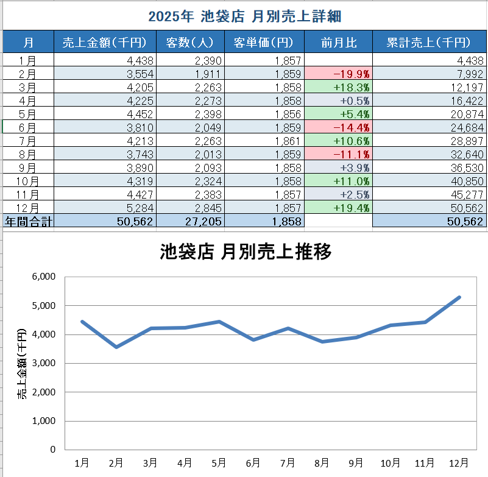

# Excel/CSV 月別売上集計レポート自動生成

複数店舗の日別売上CSVを自動集計し、年度・店舗を切り替えながら月別Excelレポートを確認できるツールです。

## デモ

### GUIランチャー
年度・店舗の切り替えとExcel出力をワンクリックで操作できるランチャー画面



### KPIダッシュボード
年間総売上・最高/最低/平均月売上・No.1店舗・客単価・前月比の6KPIカード＋月別全店推移テーブル（条件付き書式）



### 月別集計サマリー
全店舗の月別売上・客数を横断比較＋棒グラフ



### 店舗詳細
選択中の店舗の月別売上・客数・客単価・前月比・累計売上＋折れ線グラフ



## 対象クライアント

- 複数店舗を持つ小売業・飲食業の経営者・店長
- 毎月Excelで手集計している担当者
- POSや会計ソフトからCSVエクスポートできる環境

## 使い方

まず以下のフォルダ構成でファイルを配置します。

> ```
> 売上レポートツール/
> ├── gui_launcher.exe      ← これをダブルクリック
> ├── data/
> │   ├── sample/           ← 集計対象のCSVをここに入れる
> │   └── sales.db          ← 初回起動時に自動生成される
> └── output/               ← Excelが自動生成される
> ```

 1. `gui_launcher.exe` をダブルクリックで起動（初回は自動でCSVを取り込みます）
 2. 年度ドロップダウンを選択
    KPIダッシュボード・月別集計サマリーを更新、店舗リストも切り替わる
 3. 店舗ドロップダウンで任意の店舗を選択
 4. Excelを開くボタンを選択
 5. 新しいCSVを追加した場合はDB更新ボタンを選択
    CSVを再取り込みします（CSVにある行は上書き、CSVにない行はDBに保持）


## 入力CSVのフォーマット

```
日付,店舗名,売上金額,客数
2024-01-01,渋谷店,142000,75
2024-01-01,新宿店,198000,105
...
```

| 列名 | 型 | 説明 |
|------|-----|------|
| 日付 | YYYY-MM-DD | 売上日 |
| 店舗名 | 文字列 | 店舗識別名 |
| 売上金額 | 整数 | 当日売上（円） |
| 客数 | 整数 | 来店客数 |

複数店舗のCSVを同じフォルダに入れるだけで自動的に読み込みます。1ファイルに全店舗まとめてもOKです。

**注意:** 列名は上記の通り正確に入力してください。列名が異なる場合はエラーになります。

## 技術スタック

- Python 3.10+
- pandas — データ集計・ピボット処理
- openpyxl — Excelファイル生成・スタイリング・グラフ作成
- sqlite3 — 売上データの永続化（標準ライブラリ）
- customtkinter — モダンGUIランチャー（丸みボタン・カラーテーマ対応）

## 補足

**開発環境での実行**

Pythonで直接起動する場合は以下のライブラリが必要です。（gui_launcher.exeで起動する場合は不要）

```bash
pip install pandas openpyxl customtkinter
```

**サンプルデータについて**

`data/sample/` に含まれるCSVは以下のスクリプトで生成しました。

```
scripts/generate_sample_data.py
```
